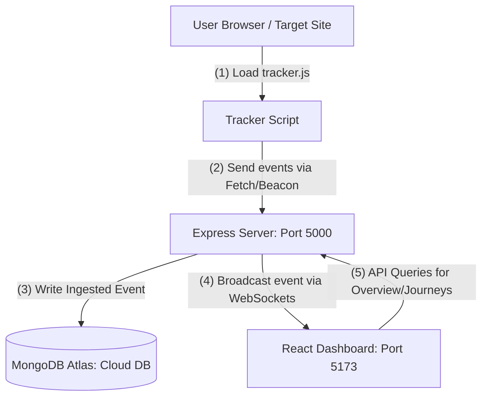

# InsightFlow | Real-Time User Analytics Platform

InsightFlow is a production-quality, high-fidelity User Analytics Platform designed to track, aggregate, and visualize user interactions (page views and mouse clicks) in real-time. It features a lightweight client-side tracking script, an Express/Socket.io ingestion server, and a premium SaaS-style React dashboard.

---

## 🚀 Live Deployments

*   **Frontend Dashboard Console:** [https://user-analytics-swart.vercel.app/](https://user-analytics-swart.vercel.app/)
*   **Backend Ingestion API Server:** [https://user-analytics-dashboard-44a7.onrender.com](https://user-analytics-dashboard-44a7.onrender.com)
*   **Static Tracker JS Script:** [https://user-analytics-dashboard-44a7.onrender.com/tracker/tracker.js](https://user-analytics-dashboard-44a7.onrender.com/tracker/tracker.js)

---

## 🏛️ System Architecture

Below is the conceptual architecture of the monorepo platform:



---

## 🛠️ Tech Stack & Monorepo Structure

*   `tracker/`: Client-side JavaScript snippet. Captures clicks and page transitions.
*   `backend/`: Express.js, Mongoose models, aggregation controllers, CORS handling, and Socket.io WebSocket handlers.
*   `frontend/`: React + Vite + Tailwind CSS dashboard with Recharts, coordinate scaling, interactive user journey maps, and visual heatmap canvas overlays.

---

## ⚙️ Environment Variables

### Backend (`backend/.env`)
Create a `.env` file in the `backend/` directory:
```env
PORT=5000
MONGODB_URI=mongodb://... # Your MongoDB Atlas connection URI
```

### Frontend (`frontend/.env` - Optional)
Create a `.env` file in the `frontend/` directory if you want to point to a production API:
```env
VITE_API_URL=https://your-deployed-backend-url.com
```

---

## 🚀 Quick Start (Local Development)

### Prerequisites
*   Node.js (v18+ recommended)
*   An active MongoDB Atlas cluster or local database

### 1. Seed Initial Mock Data
To populate the dashboard charts and overview metrics immediately:
```bash
cd backend
npm install
npm run seed
```

### 2. Start the Backend API Server
```bash
cd backend
npm run dev
```
The server will boot on `http://localhost:5000` and start listening for telemetry events.

### 3. Start the Frontend Dashboard
```bash
cd ../frontend
npm install
npm run dev
```
Open `http://localhost:5173` in your browser. 
*   **Authentication:** The console is protected. Enter the admin credentials:
    *   **Email:** `admin@insightflow.com`
    *   **Password:** `admin123`
    *   *(Or click the "Auto-fill admin credentials" button on the login card.)*

### 4. Serve the Demo Showcase Target Site
To test tracking in real-time, serve the static demo website:
```bash
cd ../demo
npx serve -l 8080
```
Open `http://localhost:8080` in your browser and click around. You will instantly see your click points and paths populate the dashboard live!

---

## 🧠 Assumptions & Engineering Trade-offs

During the design and construction of the platform, the following engineering decisions were made:

### 1. Session Storage (`localStorage` vs. `Cookies`)
*   **Decision:** We store the unique `session_id` inside the browser's `localStorage`.
*   **Trade-off:** While cookies can be sent automatically with HTTP requests, they are vulnerable to CSRF and domain scoping issues. `localStorage` is simple, doesn't expire automatically, and can be easily managed by JavaScript. For cross-subdomain tracking in enterprise setups, cookies would be preferred.

### 2. Real-Time Updates (`WebSockets` vs. `Polling`)
*   **Decision:** We integrated `Socket.io` to stream events in real-time to the dashboard.
*   **Trade-off:** WebSockets maintain an active TCP connection. In high-concurrency systems, millions of open connections can drain server resources. However, for a user experience dashboard, WebSockets provide immediate, sub-second live activity ticker updates without database polling overhead.

### 3. Visual Heatmaps (`Mock Wireframe Canvas` vs. `Iframe Mirroring`)
*   **Decision:** We overlay click dots onto a mock wireframe of the target layouts rather than embedding an `iframe` of the page.
*   **Trade-off:** Iframe mirroring (used by platforms like Hotjar) captures the exact styling of target sites but suffers from layout-shift vulnerabilities, CORS blocking, and security sandbox escapes. The wireframe canvas solves this, consumes minimal resources, and renders clicks accurately by normalizing coordinates into page-relative percentages:
    $$\text{Percentage } X = \left(\frac{x}{vw}\right) \times 100$$
    $$\text{Percentage } Y = \left(\frac{y}{vh}\right) \times 100$$

### 4. Reliability (`sendBeacon` vs. `fetch`)
*   **Decision:** The tracker uses `navigator.sendBeacon` and falls back to standard asynchronous `fetch`.
*   **Trade-off:** Standard `fetch` requests can fail during page unloads (e.g. clicking a link to go to another page). `sendBeacon` queues the request directly to the browser agent, guaranteeing delivery without blocking browser threads.

---

## 🚢 Production Deployment Guide

### Option 1: Render / Railway (PaaS - Recommended)
1.  **Backend Deployment:**
    *   Deploy as a **Web Service**.
    *   **Root Directory:** `backend`
    *   **Build Command:** `npm install`
    *   **Start Command:** `npm start`
    *   **Env Variables:** Set `MONGODB_URI` to your Atlas string and `PORT` to `5000`.
2.  **Frontend Deployment:**
    *   Deploy as a **Static Web App** (or use Vercel/Netlify).
    *   **Root Directory:** `frontend`
    *   **Build Command:** `npm run build`
    *   **Publish Directory:** `dist`
    *   **Env Variables:** Set `VITE_API_URL` to your deployed backend URL.

### Option 2: Docker Compose (VPS Deployment)
If hosting on a VPS, the platform includes a ready-to-run [docker-compose.yml](file:///c:/Users/Love/Desktop/Projects/Analytics/docker-compose.yml) file.
1.  Verify the environment variables in `docker-compose.yml` (specifically `VITE_API_URL` points to your VPS IP or domain name).
2.  Boot the containers:
    ```bash
    docker-compose up -d --build
    ```
    *This starts the MongoDB database, Backend container (port 5000), and Frontend dashboard container (port 3000).*

---

## 🔌 Integrating the Tracker Script

To track any external website or your personal portfolio, add the following script tag before the closing `</body>` tag:

```html
<script 
  src="https://<your-deployed-backend-url>/tracker/tracker.js" 
  data-host="https://<your-deployed-backend-url>">
</script>
```
