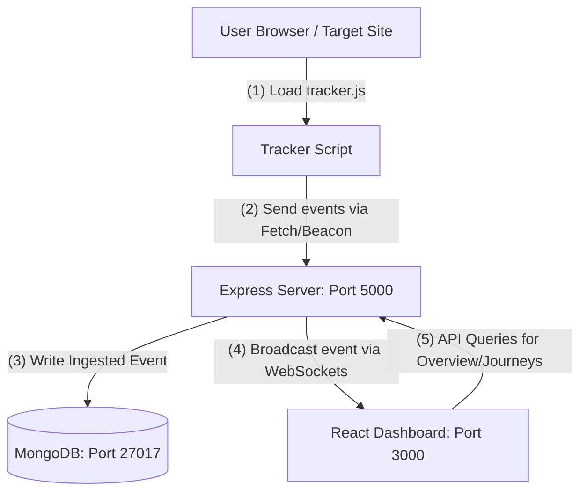

# InsightFlow | Real-Time User Analytics Platform

InsightFlow is a production-quality, high-fidelity User Analytics Platform designed to track, aggregate, and visualize user interactions (page views and mouse clicks) in real-time. It features a lightweight client-side tracking script, an Express/Socket.io ingestion server, and a premium SaaS-style React dashboard.

---

## 🏛️ System Architecture

Below is the conceptual architecture of the monorepo platform:



---

## 📂 Project Structure

InsightFlow is structured as a monorepo consisting of:
*   `tracker/`: Client-side JavaScript snippet to embed on any target website.
*   `backend/`: Express.js server, Mongoose models, aggregation controllers, and WebSocket handlers.
*   `frontend/`: React + Vite + Tailwind CSS dashboard with Recharts visualizations, interactive timelines, and coordinates-mapped canvas heatmaps.

---

## ⚙️ Environment Variables

### Backend (`backend/.env`)
Create a `.env` file in the `backend/` directory:
```env
PORT=5000
MONGODB_URI=mongodb://localhost:27017/user-analytics
```

### Frontend (`frontend/.env` - Optional)
Create a `.env` file in the `frontend/` directory if you want to point to a production API:
```env
VITE_API_URL=http://localhost:5000
```

---

## 🚀 Quick Start (Local Development)

### Prerequisites
*   Node.js (v18+ recommended)
*   MongoDB running locally on port `27017`

### 1. Ingest Inital Synthetic Seed Data
To populate the dashboard with beautiful sample charts:
```bash
cd backend
npm install
npm run seed
```

### 2. Start the Backend API Server
```bash
cd backend
npm run dev
```
The server will boot on `http://localhost:5000` and start listening for tracking events.

### 3. Start the Frontend Dashboard
```bash
cd ../frontend
npm install
npm run dev
```
Open `http://localhost:5173` in your browser. Navigating around the dashboard will trigger tracking events on itself!

---

## 🐳 Docker Deployment

The stack is containerized for seamless production setups. To spin up the database, backend, and dashboard with a single command:
```bash
docker-compose up --build
```
*   **Frontend**: accessible at `http://localhost:3000`
*   **Backend API**: accessible at `http://localhost:5000`
*   **MongoDB**: accessible at `http://localhost:27017`

---

## 🔌 Integrating the Tracker Script

To track any website, add the following script tag right before the closing `</body>` tag:

```html
<script 
  src="http://localhost:5000/tracker/tracker.js" 
  data-host="http://localhost:5000">
</script>
```

---

## 📖 API Documentation

### 1. Ingest Event
*   **Endpoint**: `POST /api/events`
*   **Payload**:
    ```json
    {
      "sessionId": "sess_82jks89w",
      "eventType": "click",
      "pageUrl": "/pricing",
      "timestamp": "2026-06-19T07:30:00.000Z",
      "x": 485,
      "y": 320,
      "vw": 1440,
      "vh": 900,
      "element": "button.buy-pro"
    }
    ```

### 2. Retrieve Sessions list
*   **Endpoint**: `GET /api/sessions`
*   **Query Params**: `search`, `sortBy` (`activity` | `duration` | `events`), `order` (`asc` | `desc`), `page`, `limit`, `startDate`, `endDate`

### 3. Retrieve Session Details (User Journey)
*   **Endpoint**: `GET /api/sessions/:sessionId`
*   **Response**: Cronological ordered timeline events representing a user's flow.

### 4. Retrieve Heatmap Coordinates
*   **Endpoint**: `GET /api/heatmap`
*   **Query Params**: `pageUrl` (e.g. `/home`)
*   **Response**: Click event arrays with relative scales `vw`/`vh`.

### 5. Aggregate Dashboard Overview
*   **Endpoint**: `GET /api/analytics/overview`
*   **Query Params**: `startDate`, `endDate`
*   **Response**: Aggregated KPI counts, top pages rankings, action mix details, and date-grouped activity timelines.

---

## 💡 Future Enhancements
1.  **Funnel Analysis**: Map multiple event paths to measure user drop-offs between pages.
2.  **Session Replay**: Record scroll events and hover positions to reconstruct full video sessions.
3.  **GeoIP Mapping**: Resolve client IP addresses to geographic locations for country demographics.
